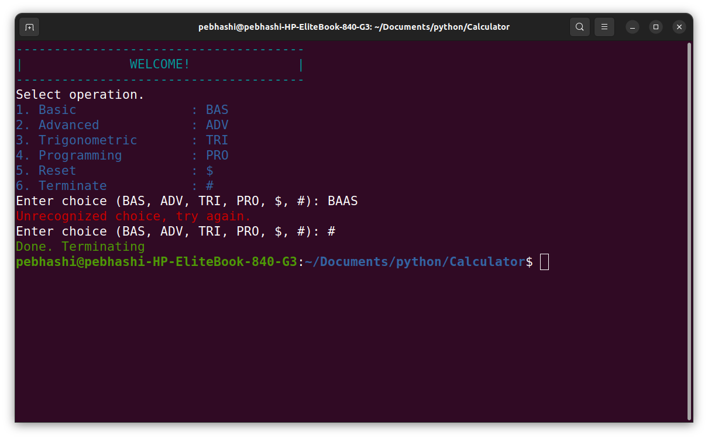
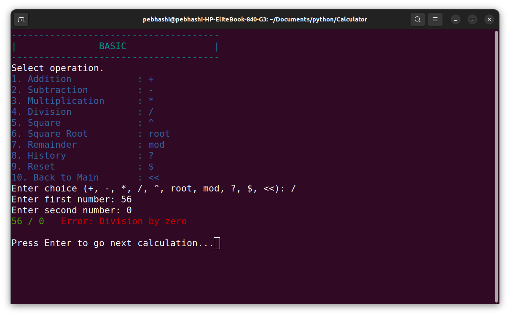
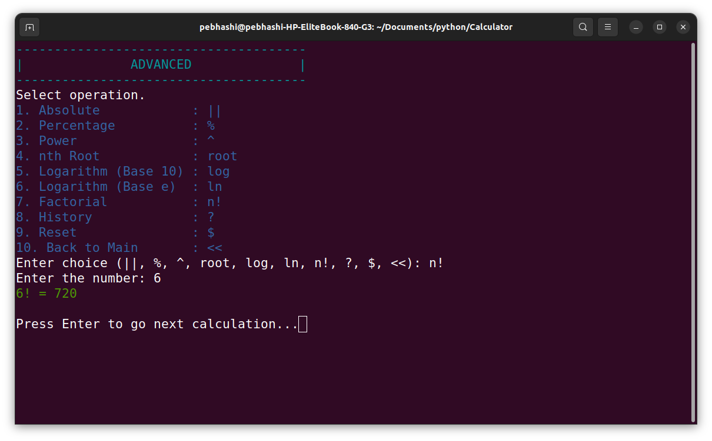
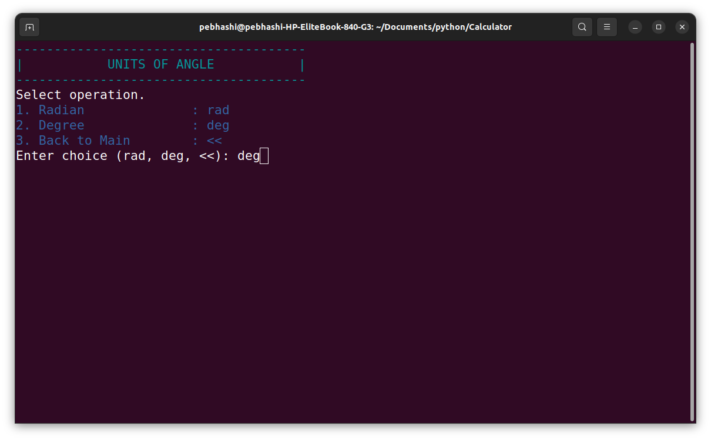
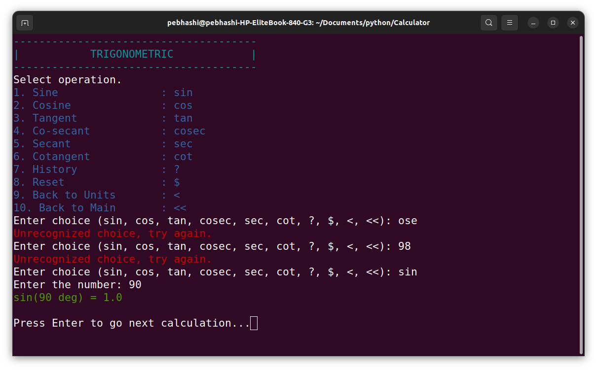
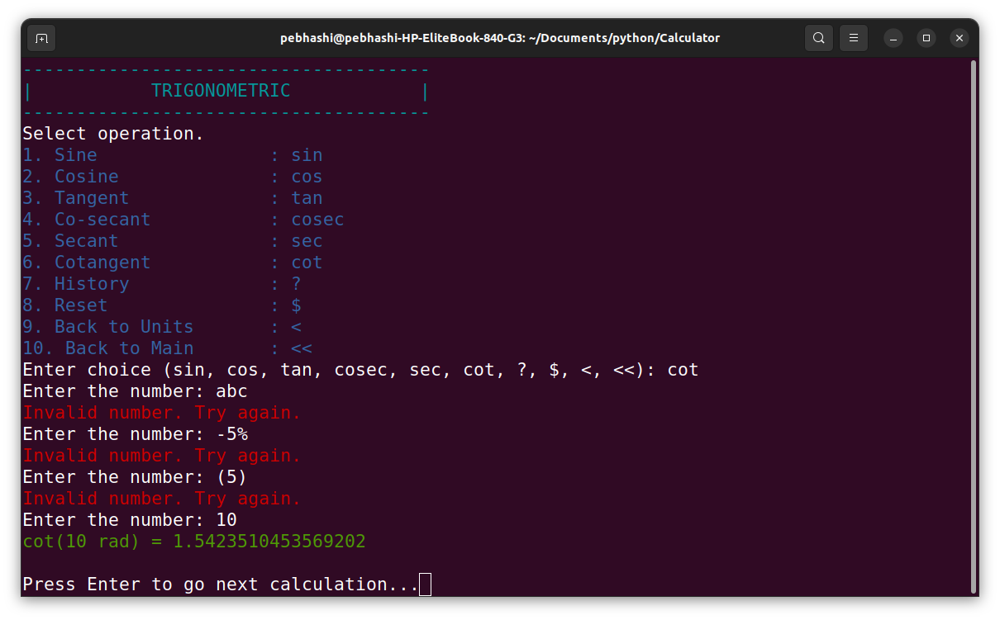
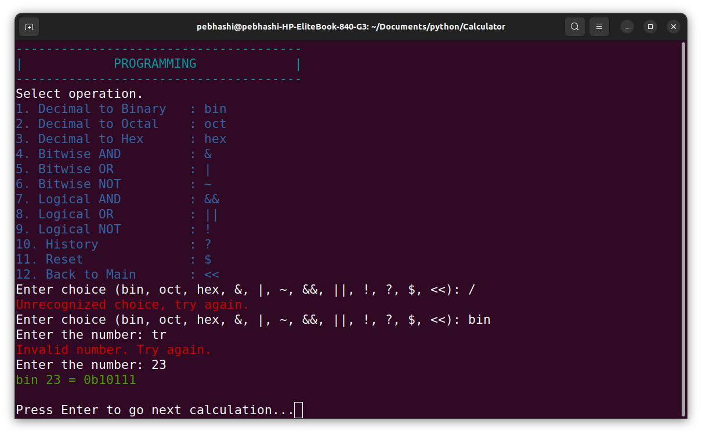
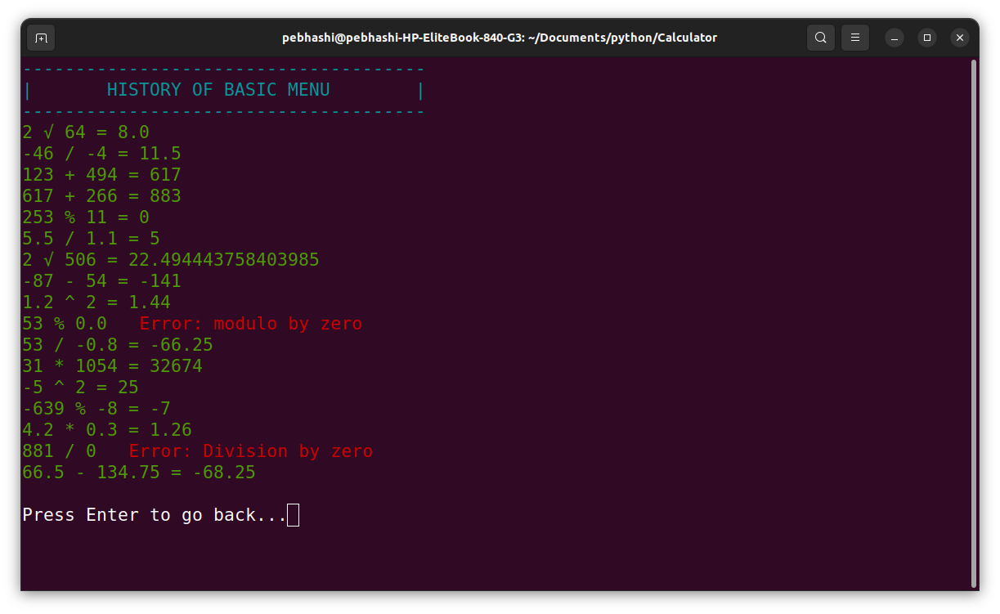

## CalcyMATH Calculator

**A versatile calculator application built using Python**, operating as a **Command Line Interface (CLI)** tool. 
It is designed to support a wide range of arithmetic calculations, whether working with **integers or decimals**. 
The operations are organized into distinct and well-defined sections, ensuring a smooth and intuitive user experience.
  

- **Basic Operations**
   Perform fundamental arithmetic operations:
  - Addition
  - Subtraction
  - Multiplication
  - Division
  - Square
  - Square Root
  - Remainder
 

- **Advanced Operations**  
   Perform higher-level mathematical operations: 
  - Absolute Value
  - Percentage Calculation
  - Power
  - nth Root Calculation
  - Base 10 Logarithm (log)
  - Base e Logarithm (ln)
  - Factorial Calculation
 

- **Trigonometric Operations**  
   Calculate trigonometric functions with options to select angular units either Radian or Degree:
  - Sine (sin)
  - Cosine (cos)
  - Tangent (tan)
  - Co-secant (cosec)
  - Secant (sec)
  - Cotangent (cot)
 

- **Programming Operations**  
   Perform number base conversions, bitwise and logical operations:
  - Decimal to Binary Conversion
  - Decimal to Octal Conversion
  - Decimal to Hexadecimal Conversion
  - Bitwise AND
  - Bitwise OR
  - Bitwise NOT
  - Logical AND
  - Logical OR
  - Logical NOT

### Features
1. **Precision Calculations:** Supports both integer and decimal operations with accuracy.   
2. **Reset Functionality:** Easily clear all current calculations and reset to the default state   
3. **Graceful Termination:** Exit the calculator smoothly with a dedicated termination command.   
4. **Calculation History:** Access past calculations and results for quick reference.   
5. **Flexible Trigonometric Modes:** Perform trigonometric calculations in either Radian or Degree units.   
6. **Organized Categories:** Arithmetic operations are categorized for ease of use.   
7. **User-Friendly CLI Interface:** Simple and intuitive navigation for seamless interaction with operations and categories.   
   

### Previews

### License
This project is licensed under the [MIT License](LICENSE).
